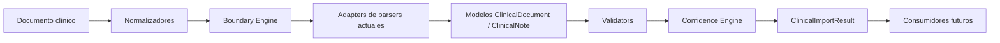
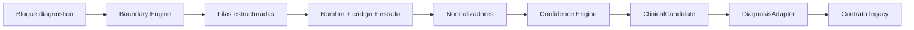
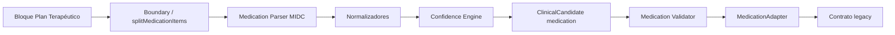
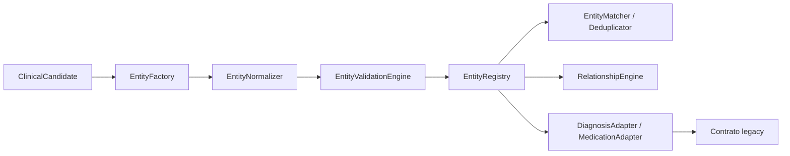

# MIDC — Motor de Interpretación Documental Clínica

## Arquitectura

MIDC es un núcleo aislado. No conoce pacientes, expedientes, Firebase, Panel Médico ni persistencia. Esos conceptos permanecen en `patient-transfer` y sus adaptadores.



## Módulos

- `core/`: modelos sin dependencias de aplicación.
- `boundaries/`: alias y límites con offsets del texto fuente.
- `normalizers/`: normalización clínica reutilizable.
- `confidence/`: reglas deterministas HIGH/MEDIUM/LOW/UNKNOWN.
- `validators/`: validación no destructiva.
- `adapters/`: compatibilidad con parsers actuales.
- `utils/`: contexto, resultado y logger.

## Contrato común de parser

```js
{
  parser,
  version,
  value,
  confidence,
  requiresReview,
  warnings,
  evidence,
  metadata
}
```

`ClinicalEvidence` conserva `documentId`, `page`, `block`, `offsetStart`, `offsetEnd`, `heading`, `rawText` y `confidence`.

## Boundary Engine

`findSectionStart()`, `findFirstBoundary()` y `extractBoundedSection()` trabajan sobre texto original y devuelven offsets. En esta fase los adapters de Subjetivo y Examen Mental llaman a los parsers actuales; no se modifica la segmentación ni el render.

## Confidence Engine

- `HIGH`: encabezado explícito o tabla estructurada.
- `MEDIUM`: inferencia entre límites reconocidos.
- `LOW`: texto libre/contexto.
- `UNKNOWN`: sin evidencia suficiente.

No usa IA ni puntuaciones opacas.

## Dependencias y compatibilidad

Los adapters importan únicamente parsers existentes de `patient-transfer`. El importador actual no importa todavía MIDC; por eso persistencia, Firebase, Panel Médico, Expediente y producción permanecen intactos.

## Plan de migración

1. Validar adapters de Subjetivo y Examen Mental con fixtures reales anonimizados.
2. Introducir un mapper de `ClinicalSection` detrás de `parseClinicalSections`.
3. Migrar Diagnósticos manteniendo `clinicalCandidateParser` como fallback.
4. Migrar Medicamentos y luego Signos Vitales.
5. Integrar el resultado en revisión sin cambiar el contrato de persistencia.
6. Migrar persistencia únicamente después de pruebas de contrato e idempotencia.

## Fase 3 — Migración de Diagnósticos

`parsers/diagnosisParser.js` es el parser nativo MIDC. Su flujo es:



El parser devuelve candidatos `ClinicalCandidate` con `candidateType: "diagnosis"`, `diagnosisName`, `normalizedDiagnosis`, `code`, `system`, `status`, `isPrimary`, `confidence`, `requiresReview`, `evidence` y `metadata`. No devuelve arreglos independientes de nombres, códigos o estados.

`DiagnosisAdapter` transforma esos candidatos al contrato que todavía consume `patient-transfer`. La interfaz, persistencia y Firebase no se modifican. El parser legacy permanece como compatibilidad histórica, pero la ruta `detectDiagnosisCandidates()` delega al parser MIDC y el flujo visible recibe el mismo esquema legacy mediante el adapter.

La evidencia conserva documento, nota, bloque, offsets, encabezado, texto original y versión del parser. Los códigos adyacentes reciben confianza `HIGH`; nombres sin código requieren revisión; códigos concatenados no se asignan por desplazamiento y quedan sin código para revisión.

Se soportan CIE-10, CIE-11 y DSM-5 en el modelo; solo CIE-10 continúa siendo persistible por las reglas existentes.

### Comparación

Antes: `clinicalCandidateParser.parseDiagnosisBlock()` separaba y construía directamente el objeto legacy; el adapter MIDC envolvía posteriormente ese resultado.

Ahora: `clinical-document-engine/parsers/diagnosisParser.js` delimita, estructura, normaliza, empareja, clasifica confianza y crea `ClinicalCandidate`; `adapters/diagnosisAdapter.js` es la única traducción hacia el contrato legacy.

### Fases siguientes

Diagnósticos y Medicamentos quedan como parsers nativos. Signos vitales y persistencia no se migran en esta fase.

Fases posteriores: PDF, OCR, Dictado y consumidores analíticos se documentan, pero no se implementan aquí.

## Fase 4 - Migración de Medicamentos

`parsers/medicationParser.js` es el parser nativo MIDC de medicamentos. Recibe cada bloque de Plan/Tratamiento, usa `splitMedicationItems()` antes de interpretar y produce un `ClinicalCandidate` por medicamento. El nombre, presentación, concentración, cantidad por administración, vía, frecuencia, acción y `schedule` se obtienen exclusivamente del ítem aislado; nunca se consulta el texto del medicamento siguiente.



El candidato nativo conserva `presentation`, `strength`, `strengthUnit`, `strengthPerValue`, `strengthPerUnit`, `administrationQuantity`, `administrationUnit`, `route`, `frequency`, `frequencyRaw`, `schedule`, `action`, `status`, `evidence` y `metadata`. Los horarios son objetos estructurados `{ time, quantity, unit }`; el adapter agrega `administrationUnit` y `scheduleText` únicamente para compatibilidad.

`MedicationAdapter` valida y transforma los candidatos al contrato legacy consumido por `patient-transfer`. `detectTreatmentCandidates()` delega al adapter; por ello la interfaz, persistencia, Panel Médico y Firebase permanecen sin cambios. El parser legacy anterior queda como implementación histórica compatible, no como ruta activa.

La confianza es determinista: nombre con concentración, vía y frecuencia explícitas recibe `HIGH`; nombre con concentración recibe `MEDIUM`; nombre sin esos datos recibe `LOW` y revisión. La validación se ejecuta en el adapter para mantener separado el parser del contrato de salida.

## Fase 5 - Clinical Entity Engine (CEE)

El CEE administra la representación clínica común sin conocer persistencia, Firebase ni la interfaz. Su entrada es cualquier candidato MIDC y su salida es una `ClinicalEntity` con identidad, versión, evidencia, relaciones y metadatos.



### Componentes

- `ClinicalEntity`: clase base para diagnosis, medication y los tipos futuros soportados.
- `ClinicalIdentity`: identidad estable por código o nombre normalizado, sin depender únicamente del texto visible.
- `ClinicalVersion`: número de versión, parserVersion y tipo de cambio.
- `ClinicalHistory`: historial en memoria para creación, cambios, normalización y fusiones; aún no persiste.
- `EntityFactory`: única conversión de `ClinicalCandidate` a `ClinicalEntity`.
- `EntityNormalizer`: reutiliza normalizadores MIDC existentes.
- `EntityValidationEngine`: delega en `DiagnosisValidator`, `MedicationValidator` y validadores futuros.
- `EntityMatcher` y `EntityDeduplicator`: matching determinista común y deduplicación en memoria.
- `EntityRelationshipEngine`: relaciones como `presenta` y `tratadoCon`, preparadas pero no activas en producción.
- `ClinicalEntityEngine`: orquesta creación, normalización, validación, registro y relaciones.

Los adapters de Diagnóstico y Medicamentos aceptan candidatos por compatibilidad y los convierten inmediatamente mediante `EntityFactory`; el contrato legacy que consume `patient-transfer` no cambia. El CEE no se conecta todavía a persistencia ni modifica el Panel Médico.

### Tipos soportados

`diagnosis`, `medication`, `vitalSign`, `laboratory`, `study`, `patient`, `treatment`, `allergy`, `scale`, `clinicalEvent`, `procedure` y `consultation` están soportados por el modelo base. Solo Diagnóstico y Medicamentos tienen parsers activos en esta fase.

### Migración futura

La Fase 6 migrará Signos Vitales, la Fase 7 Laboratorios, la Fase 8 Escalas y la Fase 9 Timeline. Cada migración debe conservar un adapter, pruebas de contrato y rollback. Persistencia, Firebase, Panel Médico y SOFÍA quedan fuera de esta fase.
