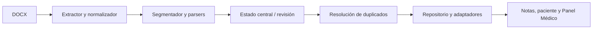

# Motor de Interpretación Documental Clínica — Fase 1

## Alcance

Esta fase audita y estabiliza el importador DOCX activo sin cambiar la estructura persistida, Firestore ni la interfaz. La entrada pública activa es `medico.html` → `js/medico.js` → `modules/patient-transfer/index.js`.

## Inventario del flujo activo

| Archivo | Responsabilidad | Entrada → salida | Clasificación | Prioridad |
|---|---|---|---|---|
| `js/modules/patient-transfer/index.js` | Apertura del módulo | evento → controlador/vista | activo, entrada | alta |
| `js/modules/patient-transfer/patientTransferController.js` | Orquestación de análisis, revisión y guardado | archivos/estado → grupos/resultados | activo, controlador | alta |
| `js/modules/patient-transfer/patientTransferState.js` | Estado global del módulo | acciones → estado | activo, estado | alta |
| `js/modules/patient-transfer/docx/docxExtractor.js` | Adaptador al extractor histórico | File → bloques crudos | adaptador | alta |
| `js/modules/importacionDocx/docxExtractor.js` | Lectura DOCX | ArrayBuffer → bloques | activo histórico compartido | alta |
| `js/modules/patient-transfer/docx/docxBlockNormalizer.js` | Normalización de bloques | bloques → bloques normalizados | activo, normalizador | alta |
| `js/modules/patient-transfer/parsing/clinicalNoteSegmenter.js` | Detección y segmentación de notas | bloques → segmentos | activo, parser | alta |
| `js/modules/patient-transfer/parsing/clinicalSectionConfig.js` | Alias clínicos y de nota | alias → reglas | activo, configuración | alta |
| `js/modules/patient-transfer/parsing/clinicalSectionParser.js` | Secciones clínicas y delimitación de Examen Mental | bloques → secciones/encabezados | activo, parser | alta |
| `js/modules/patient-transfer/parsing/subjectiveSectionParser.js` | Subjetivo aislado y edición | segmento → resultado Subjetivo | activo, parser | alta |
| `js/modules/patient-transfer/parsing/clinicalCandidateParser.js` | Diagnósticos y tratamientos | secciones/bloques → candidatos | activo, parser | alta |
| `js/modules/patient-transfer/parsing/patientFieldParser.js` | Campos administrativos | bloques → campos | activo, parser | alta |
| `js/modules/patient-transfer/parsing/patientDuplicateMatcher.js` | Coincidencias y normalizadores de identidad | candidato/pacientes → matches | activo, parser | alta |
| `js/modules/patient-transfer/parsing/vitalSignsParser.js` | Signos vitales | bloques → candidatos | activo, parser | alta |
| `js/modules/patient-transfer/parsing/documentGroupingService.js` | Agrupación por paciente | documentos → grupos | activo, servicio | alta |
| `js/modules/patient-transfer/integration/patientCreationAdapter.js` | Adaptador de creación | campos → patientId | activo, adaptador | alta |
| `js/modules/patient-transfer/integration/noteCreationAdapter.js` | Adaptador de notas | segmento → nota | activo, adaptador | alta |
| `js/modules/patient-transfer/integration/clinicalDataImportAdapter.js` | Diagnósticos/tratamientos | candidatos → repositorios reales | activo, adaptador | alta |
| `js/modules/patient-transfer/patientTransferRepository.js` | Persistencia y verificación | grupos → resultados | activo, repositorio | alta |
| `js/modules/patient-transfer/ui/patientTransferView.js` | Modal, revisión y resultados | estado → DOM | activo, vista | alta |
| `js/modules/importacionDocx/docxImportConfig.js` | Reglas de campos y validación | configuración → parsers | compartido/legacy | media |
| `js/modules/importacionDocx/noteTypeDetector.js` | Tipo documental | texto → tipo | adaptador compartido | media |

No se eliminó ningún módulo legacy. `importacionDocx` sigue siendo dependencia de extracción, configuración y tipo documental; no es una segunda puerta visible del flujo.

## Flujo real

### Analizar documentos

1. `patientTransferController.analyzeOneFile()` valida el archivo, llama a `extractDocx()`, normaliza con `normalizeDocxBlocks()` y construye texto/hash.
2. Ejecuta `parsePatientFields()`, `resolvePatientIdentity()`, `parseNoteMetadata()`, `detectMultipleClinicalNotes()` y `segmentClinicalNotes()`.
3. Cada segmento obtiene sus bloques aislados, `parseClinicalSections()`, `extractClinicalCandidates()` y `extractVitalSignsCandidates()`.
4. `groupDocumentsByPatient()` agrupa sin perder `noteSegments`.
5. `renderDetectedGroups()` presenta la revisión; las selecciones se conservan en el estado central.

### Confirmar traspaso

1. `saveReviewedTransfer()` toma grupos del estado, resuelve coincidencias y llama a `saveTransferredGroups()`.
2. El repositorio adquiere/reutiliza `transferOperationId`, crea o reutiliza el paciente mediante `createTransferredPatient()`, verifica `patientId`, y crea las notas secuencialmente.
3. Los adaptadores guardan diagnósticos/tratamientos en los repositorios reales y se verifica el resultado.
4. El controlador libera `isSaving` en `finally`, actualiza estado visual y renderiza completed/partial/failed.

## Fuentes de verdad y adaptadores

| Concepto | Campos actuales | Fuente propuesta en Fase 1 | Adaptador |
|---|---|---|---|
| Documento | `documents`, `selectedFiles`, `documentCandidate` | documento en `selectedFiles`/estado | controlador |
| Segmento | `noteSegments` | `document.noteSegments[]` | segmenter/persistence expansion |
| Secciones | `sections`, `secciones` | `segment.sections` y resultado de `parseClinicalSections` | mapper de secciones |
| Diagnóstico | `diagnosisName`, `normalizedName`, `code`, `codingSystem`, `system` | candidato de `clinicalCandidateParser` | clinicalDataImportAdapter |
| Medicamento | `medicationName`, `dose`, `strengthValue`, `schedule` | candidato de `clinicalCandidateParser` | clinicalDataImportAdapter |
| Subjetivo | `subjective`, `subjetivo` | `segment.sections.subjetivo` | UI/state adapter |
| Paciente | `patientId`, `uid`, `medicoUid` | `patientId` para notas; `medicoUid` para alcance | repository |
| Duplicado | `possibleMatches`, `highestMatch`, `selectedResolution` | candidato de `patientDuplicateMatcher` | UI/repository |
| Persistencia | `TRANSFER_STATUS`, `lastCompletedStage`, resultados | estado del controlador | repository |

Duplicaciones confirmadas: normalización textual local en varios parsers; alias administrativos en `docxImportConfig`; alias clínicos en `clinicalSectionConfig` y listas locales de Subjetivo; nombres legacy de campos clínicos. Se documentan, pero no se eliminan en esta fase.

## Contratos y utilidades de Fase 1

Se añadieron `clinicalImportContracts.js`, `clinicalImportEvidence.js` y `clinicalImportLogger.js`. Definen JSDoc para `DocumentCandidate`, `ClinicalNoteSegment`, `ClinicalSections`, `DiagnosisCandidate`, `MedicationCandidate`, `VitalSignsCandidate`, `DuplicatePatientMatch` y `TransferPersistenceResult`, además de validadores no invasivos.

`clinicalBoundaryEngine.js` centraliza `findFirstBoundary()`, `findSectionStart()` y `extractBoundedSection()`. `subjectiveSectionParser.js` mantiene su API pública, pero `findFirstBoundaryInsideText()` delega al motor común. `clinicalSectionParser.js` usa esa API para el límite de Examen Mental; por ello Subjetivo y Examen Mental comparten la misma búsqueda con offsets originales.

La confianza común es cualitativa: `high` para encabezado/límite explícito, `medium` para posición entre estructuras reconocidas, `low` para evidencia contextual y `not-detected` cuando no hay extracción. No se cambió todavía el render ni la persistencia para depender del envoltorio común.

## Trazas

Las trazas existentes se mantienen para validación. El nuevo `clinicalImportLogger` permite apagar trazas futuras del módulo sin cambiar la consola global. No se imprimen documentos completos; las trazas históricas que aún contienen más contexto quedan pendientes de conversión gradual.

## Regresión y fixtures

La suite `patient-transfer*.test.mjs` cubre notas múltiples, alias con/sin acento, tablas, campos, duplicados, diagnóstico/código, medicamentos, signos vitales, guardado y Subjetivo. Los nuevos contratos prueban offsets, delimitación común, confianza, evidencia y referencias independientes. Los casos históricos de Ana, Ismerai y María se representan en pruebas con texto mínimo/sintético; no se incorporan DOCX ni nombres completos a fixtures públicos.

## Riesgos pendientes

- Hay mojibake histórico en algunos alias literales; el comportamiento actual se conserva y debe normalizarse en una migración separada.
- `importacionDocx` continúa siendo dependencia compartida y no debe retirarse hasta desacoplar extracción/configuración/tipo documental.
- Existen campos legacy paralelos de secciones, dosis y códigos; requieren mappers antes de una consolidación completa.
- La validación manual de producción sigue siendo necesaria para cualquier cambio de parser.

## Plan de Fase 2: `clinical-document-engine`

1. Migrar primero los contratos/adaptadores y el motor de límites, conservando las APIs actuales.
2. Migrar después configuración de alias y normalizadores confirmadamente duplicados.
3. Mantener `clinicalCandidateParser`, `patientFieldParser` y `vitalSignsParser` detrás de adaptadores hasta que sus pruebas de contrato sean equivalentes.
4. No mover todavía `importacionDocx`, repositorios, Firebase, persistencia ni la vista.
5. Vigilar dependencias circulares entre `clinicalSectionParser`, `subjectiveSectionParser`, configuración y segmentador.
6. Cada migración debe tener feature flag o cherry-pick reversible, suite completa y rollback al adaptador anterior.
7. Retirar legacy solo después de una búsqueda de consumidores, cobertura de contrato y validación manual en producción.

