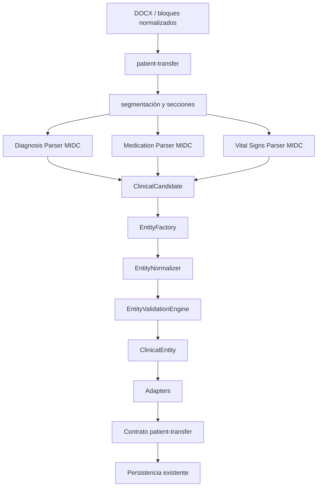

# Mapa de dependencias MIDC v1

El mapa fue revisado a partir de los imports ESM del directorio `js/modules/clinical-document-engine` y de los puntos de entrada activos de `patient-transfer`.

## Capas

| Capa | Directorio | Depende de | Consumida por |
|---|---|---|---|
| Core | `core/`, `entities/` | modelos mínimos y normalizadores puntuales | engine, parsers, adapters |
| Boundary | `boundaries/` | texto normalizado | Diagnosis Parser y parsers legacy de secciones |
| Parsers | `parsers/` | core, boundaries, confidence, normalizadores, logger | adapters y patient-transfer |
| CEE | `engine/` | entidades, validadores, normalizadores, logger | adapters y pruebas |
| Adapters | `adapters/` | parsers, EntityFactory, validadores | patient-transfer |
| Compatibilidad | `patient-transfer/` | adapters y parsers legacy | medico.html, repositorio |

## Límites

- Diagnósticos usa `extractBoundedSection()` y el catálogo central de aliases.
- Medicamentos recibe el bloque Plan/Tratamiento ya delimitado por `clinicalSectionParser`; `splitMedicationItems()` solo divide ítems internos.
- Signos vitales recibe tablas por bloque; no recorta texto clínico ni abre nuevas secciones.
- Subjetivo y Examen Mental siguen usando adapters hacia parsers legacy y son el pendiente principal de migración.

## Imports muertos y ciclos

La auditoría estática no encontró ciclos dentro del MIDC ni imports ESM muertos en la ruta activa. Las referencias legacy conservadas están documentadas en `legacy-map.md`.
