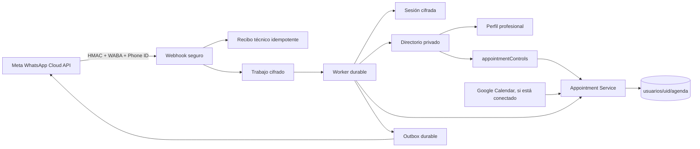

# WhatsApp oficial multi-profesional — auditoría y entrega local

Fecha de corte: 9 de septiembre de 2026. Proyecto Firebase: `cognicion-57052`. Repositorio canónico: `D:\Escritorio\PROYECTO COGNICION\1-back`, rama `main`.

## Resultado ejecutivo

El backend local ya distingue formalmente dos modos:

- `pilot`: conserva la lista cerrada de profesionales y destinatarios del piloto anterior.
- `production`: acepta cualquier remitente válido que llegue firmado por Meta al Phone Number ID oficial, pero sólo ofrece profesionales con perfil clínico vigente, configuración pública completa y Agenda realmente reservable.

Agenda continúa siendo la única fuente de verdad para disponibilidad, creación, confirmación, reprogramación y cancelación. El bot no mantiene un calendario paralelo. Las identidades y el estado conversacional sensible permanecen cifrados con KMS; las métricas son contadores técnicos sin teléfonos, nombres ni texto.

**NO-GO de producción:** el token disponible no tiene asignado ni puede descubrir el WABA/Phone Number ID del número comercial terminado en **8280**. Por tanto no se cambió el canal remoto al número oficial, no se suscribió un WABA desconocido, no se creó una plantilla contra el activo equivocado y no se hizo una prueba real desde el teléfono terminado en **1091**.

El piloto remoto que apuntaba al número de prueba 4677 se encontró habilitado con un destinatario y un profesional. Se aplicó el kill switch reversible: `channel.enabled=false`, profesional y recordatorios deshabilitados. El Scheduler `whatsappBotDrain` ya estaba `PAUSED`. No se borraron sesiones, vínculos, citas, jobs ni outbox.

## Estado real descubierto en Meta

Consulta realizada con Graph API `v26.0`, usando el secreto sólo en memoria y sin imprimirlo ni guardarlo.

| Elemento | Estado observado |
|---|---|
| App Meta | `COGNICIÓN`, App ID `2276183486553087` |
| Sujeto del token | usuario de sistema `cognicion_whatsapp_bot`, ID `122101388649470384` |
| Tipo/vigencia del token | `SYSTEM_USER`, válido, sin expiración informada (`expires_at=0`) |
| Permisos | `whatsapp_business_management`, `whatsapp_business_messaging`, `public_profile` |
| WABA accesible | `1431133919107745`, nombre `Test WhatsApp Business Account` |
| Phone Number ID accesible | `1324304140766499` |
| Número accesible | número de prueba terminado en **4677**; no es el 8280 |
| Plataforma/estado | `CLOUD_API`, `CONNECTED`, modo de cuenta `LIVE`, calidad `GREEN` |
| Verificación del número | `NOT_VERIFIED`; nombre `Test Number`, `AVAILABLE_WITHOUT_REVIEW` |
| Revisión/verificación del negocio | cuenta aprobada; verificación de negocio `pending_submission` |
| Suscripción del WABA a la app | no aparece ninguna en `/subscribed_apps` |
| Webhook de la app | callback de COGNICIÓN activo para `whatsapp_business_account`, incluido `messages` |
| Plantillas | sólo plantillas de ejemplo de Meta; ninguna plantilla administrativa de COGNICIÓN |
| Perfil comercial | únicamente sitio web; sin descripción, correo, dirección ni imagen observables |
| WABA asignados al usuario de sistema | ninguno en `assigned_whatsapp_business_accounts` |
| Negocio propietario visible al token | no disponible con este token |
| Número oficial ···8280 | no descubrible ni operable con el acceso actual |
| Coexistencia con WhatsApp Business App | no demostrable con el acceso actual; no se modificó |

La suscripción del webhook a nivel de app y la suscripción de la app a un WABA son estados distintos. La primera existe; la segunda está ausente para el WABA de prueba consultado. Producción ahora exige ambas: activo exacto verificado y WABA suscrito.

## Acción humana mínima pendiente en Meta

Una persona con control del portafolio comercial debe completar en Meta, sin compartir códigos o contraseñas:

1. Identificar el WABA que contiene el número terminado en 8280 y confirmar su propiedad.
2. Completar cualquier verificación legal, OTP o aceptación que Meta exija.
3. Decidir y completar el flujo oficial de Cloud API/coexistencia si el 8280 debe conservar la app WhatsApp Business. No iniciar una migración destructiva sin copia, ventana y rollback.
4. Asignar ese WABA y su Phone Number ID al usuario de sistema `cognicion_whatsapp_bot` con los dos permisos de WhatsApp ya declarados.
5. Confirmar que el número aparece como `CLOUD_API` y `CONNECTED` y que `/subscribed_apps` contiene `COGNICIÓN`.
6. Entregar al administrador sólo WABA ID, Phone Number ID, versión Graph y los últimos cuatro dígitos; nunca el token.

Una vez visible, el panel local “Verificar activos en Meta” comprueba pertenencia Phone→WABA, sufijo 8280, Cloud API, conexión y suscripción. La configuración de producción no puede habilitarse si alguna prueba falla.

## Arquitectura implementada

### Fuente de verdad y directorio

`whatsappBotProfessionals/{uid}` es la proyección privada y autoservida del profesional. Contiene exclusivamente datos públicos de reserva y configuración de recordatorios:

- `enabled`, `label`, `displayName`, `specialty`, `slug`, `aliases`;
- `services[]`: `id`, `label`, `durationMinutes`, `modality` opcional;
- `location`, `acceptsNewPatients`;
- `reminders` y plantilla configurada.

La proyección no basta por sí sola. Antes de mostrarla, el servidor verifica:

- perfil clínico aún autorizado y cuenta sin tombstone;
- `appointmentControls/{uid}.enabled=true`;
- `policy.bookingEnabled=true`, zona IANA y ausencia de pago obligatorio sin proveedor;
- documento completo y habilitado.

El resolver normaliza acentos, mayúsculas y separadores, y busca por nombre exacto, alias o slug; después permite coincidencias parciales por tokens. Una coincidencia ambigua nunca se elige automáticamente: se devuelve una lista explícita. Un slug duplicado habilitado no puede guardarse.

### Conversación y estado

Sofía se identifica como asistente administrativa. Comandos globales: `hola`, `inicio`, `menú`, `ayuda`, `agendar`, `mis citas`, `confirmar`, `reprogramar`, `cancelar`, `recordatorios`, `hablar con alguien`, `salir` y baja de recordatorios.

Flujo de reserva:

1. bienvenida/menú;
2. resolución o selección de profesional;
3. servicio/modalidad;
4. fecha;
5. slots reales del Appointment Service;
6. nombre administrativo mínimo;
7. consentimiento separado para recordatorios;
8. resumen;
9. confirmación explícita ligada al mensaje vigente;
10. persistencia transaccional e idempotente en Agenda.

Los botones llevan un nonce derivado del trabajo y vencen a los 15 minutos. Un botón viejo, un “sí” libre, un mensaje fuera de orden o una repetición no autoriza mutaciones. La sesión tiene lease y TTL; el trabajo y el outbox son durables. Si una disponibilidad externa requerida no puede consultarse, falla cerrado y no confirma éxito.

Las citas sólo pueden verse o modificarse si existe un vínculo explícito entre el sujeto HMAC, el profesional y el appointment ID. Un remitente no puede enumerar pacientes, buscar expedientes por teléfono ni operar la agenda de otro profesional.

### Handoff y seguridad clínica

“Hablar con alguien” registra `handoff.active` en el destinatario privado. Mientras está activo, se detienen altas, confirmaciones, reprogramaciones, cancelaciones y recordatorios. El panel administrativo lista una cola mínima con motivo técnico, hora y sólo los últimos cuatro dígitos del teléfono descifrado en servidor; no devuelve texto ni identidad completa. Sólo un administrador puede marcar la solicitud como atendida.

Solicitudes de diagnóstico, dosis, medicamentos, síntomas o tratamiento se redirigen a atención humana sin respuesta clínica. Señales deterministas de suicidio/autolesión, sobredosis u otra urgencia muestran una instrucción de emergencia inmediata y registran el handoff. El bot no realiza triage, diagnóstico ni recomendaciones terapéuticas.

### Privacidad y observabilidad

- teléfonos, texto, nombre y sesión: cifrados; no se escriben en logs;
- IDs de mensajes del proveedor: sólo hash;
- recibos y contadores: técnicos, sin PHI;
- métricas diarias en `whatsappBotRate/metrics_YYYYMMDD` e idempotencia por evento;
- límites: 200 caracteres de entrada, 30 entradas por minuto y 500 por día por sujeto, diez opciones, 50 profesionales cargados, 50 vínculos por destinatario, pacing de salida global y por destinatario, cinco reintentos;
- todos los grupos `whatsappBot*` permanecen bloqueados para clientes por Firestore Rules.

## Plantillas propuestas, no creadas

No se envió ninguna plantilla a Meta porque el WABA oficial no es accesible. Nombres y categoría sugeridos para crear en el activo correcto:

| Nombre | Categoría sugerida | Variables mínimas | Estado real |
|---|---|---|---|
| `cognicion_cita_recordatorio_v1` | Utility | profesional, fecha/hora, zona/modalidad | no creada |
| `cognicion_cita_confirmacion_v1` | Utility | profesional, fecha/hora | no creada |
| `cognicion_cita_reprogramacion_v1` | Utility | profesional, nueva fecha/hora | no creada |
| `cognicion_cita_cancelacion_v1` | Utility | profesional, fecha/hora cancelada | no creada |

El código consulta el estado real antes de cada envío fuera de la ventana de 24 horas. Sólo `APPROVED` permite enviar; `PENDING`, `REJECTED`, `PAUSED`, `DISABLED`, ausente o desconocido bloquean el mensaje. Nunca se afirma aprobación pendiente.

## Pagos

No se encontró proveedor de pago real y verificado para este flujo. No se implementó cobro, link simulado ni estado ficticio. Una política de Agenda con pago obligatorio falla cerrado y no ofrece reserva por WhatsApp.

## Pruebas

- Baseline previo: 34/34 pruebas del bot.
- Emulador ampliado: 40 escenarios, incluidos piloto, producción abierta, dos profesionales, coincidencia ambigua, reserva en la agenda seleccionada, privacidad, límite de abuso, handoff, urgencia, métricas, Meta inspection, concurrencia e idempotencia.
- Suite integral Agenda/WhatsApp: 225 pruebas ejecutadas; 224 PASS y 1 FAIL ajeno a estos archivos, en el cambio concurrente `appointment-google-calendar-emulator.test.mjs`: el caso nuevo envía `timeZone` en `input`, campo que el contrato vigente de `Appointment Service` rechaza como `invalid-input`.
- El controlador real del panel y los contratos de transporte/inspección Meta pasaron dentro de la suite integral.

No se hicieron pruebas reales con pacientes, citas, teléfonos ni mensajes de producción.

## Limitaciones aún abiertas

- Falta el activo Meta oficial 8280 y conocer el estado real de coexistencia/migración.
- Las plantillas administrativas no existen en el WABA correcto y no tienen estado de aprobación.
- La cola de handoff es operable desde el panel, pero requiere consulta manual; no existe un proveedor autorizado de aviso push/correo a secretaría.
- No hay proveedor de pagos configurado, por diseño.
- El despliegue y QA real están bloqueados por el activo oficial y por la mezcla con cambios concurrentes descrita abajo.

## Despliegue, rollback y publicación

No se desplegó backend porque el árbol contiene cambios concurrentes de Google Calendar en `functions/index.js`, `functions/appointments/service.mjs`, Rules e índices. Firebase empaqueta el origen completo aun con `--only`; desplegar ahora mezclaría trabajo ajeno y viola el criterio de despliegue selectivo. Tampoco se publicó frontend, no se creó commit y no hubo `git push`.

Cuando el activo oficial esté asignado, la prueba concurrente esté verde y el diff se haya revisado por rutas:

1. ejecutar `scripts/test-agenda-whatsapp.ps1`;
2. desplegar únicamente `whatsappWebhook`, `configureWhatsAppBot`, `whatsappBotWorkCreated`, `whatsappBotDrain` y `whatsappBotAppointmentChanged` junto con cualquier `manageAppointment` que forme parte de la misma revisión aprobada;
3. configurar el canal oficial inicialmente detenido, verificar activos y suscripción, y luego habilitar;
4. probar desde el 1091: bienvenida, resolución, disponibilidad, alta, confirmación, reprogramación, cancelación, recordatorio aprobado y handoff;
5. verificar que Agenda refleja exactamente los cambios y que no hay duplicados ni fuga entre profesionales.

Rollback inmediato: `whatsappBotConfig/channel.enabled=false`, pausar `whatsappBotDrain`, deshabilitar el profesional afectado y conciliar cualquier outbox `uncertain` sin reenvío ciego. La reversión de una migración/coexistencia del número es un procedimiento de Meta y debe quedar documentada antes de iniciarla.

Versión visible preparada: **2.207 → 2.208**. Permanece local hasta que el usuario publique el frontend.
