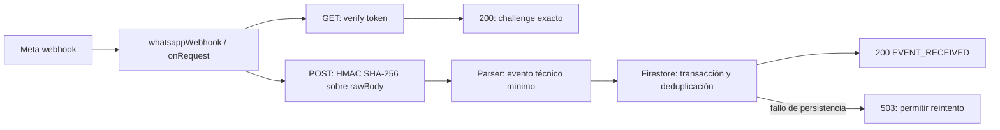

# WhatsApp 1: webhook seguro de recepción

Implementación local de COGNICIÓN, versión **2.192 → 2.193** (+0.001 conforme a `js/config/appVersion.js`). Sin despliegue, commit, push ni escrituras en Meta/Google Cloud. No se generaron secretos de producción ni se solicitaron access tokens, App Secret, Phone Number ID o WABA ID. Los valores usados en tests son fixtures públicos sintéticos.

## Arquitectura auditada

- Repositorio canónico: `D:\Escritorio\PROYECTO COGNICION\1-back`, rama `main`.
- Firebase: proyecto `cognicion-57052`, código `functions`, codebase `default`, Node 24, Functions SDK v2.
- `functions/index.js` inicializa Firebase Admin una vez y comparte `adminDb`. El webhook recibe esa instancia; ningún módulo nuevo inicializa Admin.
- Google Calendar OAuth ya estaba presente como cambio local, con secretos propios, PKCE, KMS, estado de un solo uso y colecciones `googleCalendarOAuthStates` / `googleCalendarConnections`. Se preservó, sin conectar WhatsApp con Calendar, agenda ni Appointment Service.
- La colección general `auditoria` admite lectura de clientes administradores y creación de clientes autenticados. Por esa razón no se usa para la recepción de WhatsApp: el recibo técnico debe ser exclusivamente del servidor.
- Las reglas tienen un cierre global `deny`; se añade además una denegación explícita para la colección técnica y sus descendientes.
- `.gitignore` ya protegía `.env` y los archivos Functions `.env.*`. Se añadió `functions/.secret.local` y un directorio acotado de artefactos locales de prueba.



No hay cola, consumidor, bot ni trabajo posterior al ACK en esta fase. El límite futuro está entre la normalización y la persistencia: una fase posterior podrá introducir una bandeja transaccional y un consumidor idempotente. **No se deben añadir efectos externos simplemente después de crear el recibo**, porque un fallo entre ambos pasos perdería la acción. Los recibos de esta fase son evidencia técnica, no trabajos pendientes para reproducir después.

## Function y URL prevista

Export: `whatsappWebhook`, HTTP `onRequest`, segunda generación, `us-central1`, invocador público, `cors: false`, timeout 15 segundos, memoria 256 MiB y máximo 5 instancias.

URL pública prevista, confirmada a partir del proyecto y región del repositorio:

**https://us-central1-cognicion-57052.cloudfunctions.net/whatsappWebhook**

Es una URL prevista: no se ha desplegado ni comprobado en producción. Tras el despliegue, comparar con la URL que entregue Firebase CLI. El servicio también puede tener una URL `run.app`; no se necesita conocerla para implementar esta fase.

## Contrato HTTP y firma

| Solicitud | Resultado |
| --- | --- |
| GET: mode `subscribe`, token válido y challenge escalar no vacío | 200, `text/plain`, challenge exacto, conservando ceros iniciales |
| GET: token/modo ausente, incorrecto o no escalar | 403 |
| GET: token válido pero challenge ausente, vacío o no escalar | 400 |
| POST: firma válida y recibo técnico confirmado | 200 `EVENT_RECEIVED` |
| POST: firma ausente, incorrecta, duplicada o mal formada | 403; no parser/persistencia de aplicación |
| POST: falta el Buffer rawBody | 400; no fallback a request.body |
| POST: JSON firmado pero inválido | 400 |
| POST: tipo de evento desconocido | 200, diagnóstico mínimo; no acciones |
| Secreto de runtime ausente/inaccesible | 503; cierre seguro |
| Firestore no confirma el recibo | 503; no afirmar recepción duradera |
| Otros métodos, incluidos OPTIONS y HEAD | 405, `Allow: GET, POST` |

`security.js` calcula `HMAC-SHA256(META_APP_SECRET, request.rawBody)` y compara el resultado con los 32 bytes hexadecimales de `X-Hub-Signature-256: sha256=...` mediante `timingSafeEqual`. El token GET también se compara mediante digests de longitud fija y `timingSafeEqual`.

Firebase expone `Request.rawBody` como Buffer original. El runtime HTTP puede haber interpretado JSON para llenar `request.body`; esta aplicación no consulta ese objeto, no vuelve a serializarlo y no usa su contenido para autenticar ni normalizar. Valida el Buffer primero y después interpreta ese mismo Buffer. La prueba HTTP usa el wrapper real `onRequest`, middleware JSON real con el hook de conservación de bytes del runtime Firebase y tráfico exclusivamente loopback; incluye bytes UTF-8, espacios y escapes que cambian al reserializarse.

Fuentes primarias: [Request.rawBody de Firebase](https://firebase.google.com/docs/reference/functions/firebase-functions.https.request.md), [mecanismo webhook documentado por WhatsApp/Meta](https://whatsapp.github.io/WhatsApp-Nodejs-SDK/api-reference/webhooks/start/), [implementación de referencia de Meta](https://github.com/WhatsApp/WhatsApp-Nodejs-SDK/blob/main/src/api/webhooks.ts). No se instaló ni usó el SDK de WhatsApp; el código de recepción es propio y no hereda su logging. Las páginas Graph API de Meta devolvieron restricciones de acceso durante la consulta; se usaron también las referencias primarias públicas de Meta.

## Parser y minimización

`parser.js` reconoce el sobre `whatsapp_business_account`, `entry[].changes[]`, campo `messages` y producto `whatsapp`. Procesa todas las entradas del lote, manteniendo separados `value.messages[]` y `value.statuses[]`.

Evento interno, sólo en memoria:

```js
{
  provider: "whatsapp",
  eventType: "message", // o status.sent / status.delivered / status.read / status.failed
  messageId: "wamid.synthetic-example", // fixture; nunca se persiste ni se registra en claro
  messageType: "text", // también interactive, button y otros tipos conocidos; null para estados
  receivedAt: 1788912000000 // ejemplo sintético; reloj del servidor
}
```

Reconoce `text`, `interactive`, `button` y otros tipos de medio por su etiqueta; no lee ni propaga cuerpos, respuestas, payloads de botones, nombres, teléfonos, contactos, metadatos, errores de Meta ni medios. Los valores desconocidos se convierten en enums fijos `unknown`, no se copian a logs. Un mensaje sin ID válido se clasifica `message.unidentified`, se reconoce con ACK y no crea un recibo utilizable para acciones. Un estado desconocido tampoco se persiste.

Límites explícitos de esta fase: **1 MiB de raw body y 100 eventos normalizados por solicitud**. El exceso produce 413 sin persistencia parcial. Antes de uso a mayor escala, revisar esos límites con tráfico autorizado: un lote legítimo que exceda el límite no se acepta.

## Deduplicación y Firestore

Colección nueva: `whatsappWebhookEvents/{eventIdHash}`.

Clave: SHA-256 de la tupla JSON `["whatsapp", eventType, messageId]`. El teléfono no se usa como ID ni como fuente del hash. Para mensajes, la clave no cambia con el contenido, tipo, hora de recepción o rotación de secretos. Para estados, el estado forma parte de la clave: recibir `sent` no suprime `delivered`, `read` ni `failed` del mismo mensaje.

Una transacción realiza las lecturas y crea sólo documentos inexistentes, con máximo tres intentos del SDK. También elimina duplicados dentro del mismo lote. El logging ocurre después del commit, fuera del callback transaccional, para que sus reintentos no generen logs falsos de aceptación. Si falla Firestore no se devuelve un ACK satisfactorio.

Únicos campos persistidos:

| Campo | Contenido |
| --- | --- |
| schemaVersion | 1 |
| provider | whatsapp |
| eventIdHash | SHA-256 del identificador técnico |
| eventType | message o uno de los cuatro estados conocidos |
| messageType | Enum fijo; null para estados |
| receivedAt | Timestamp de servidor al recibir por primera vez |

No se guardan conversaciones, identificadores Meta originales, teléfonos ni datos clínicos. No hay recuperación de contenido ni renderizado cliente. El único acceso posterior implementado es la comprobación de existencia dentro de la deduplicación.

No se activó TTL ni borrado de recibos. **Eliminar recibos reduce la ventana de deduplicación** y permite que un reenvío antiguo vuelva a producir un recibo. Debe definirse una política de conservación antes de ampliar la fase; hoy queda una colección mínima sin expiración automática.

Regla explícita:

```text
match /whatsappWebhookEvents/{document=**} {
  allow read, write: if false;
}
```

Se probó denegación de lectura individual, consultas, creación, actualización, borrado y descendientes para clientes anónimos, pacientes, médicos y administradores. Admin SDK conserva el acceso del servidor conforme a IAM; no se modificaron permisos IAM en esta tarea.

## Privacidad de aplicación e infraestructura

Los únicos campos de logging de aplicación son:

```js
{ eventType, hasMessage, messageType, timestamp, deduplicated }
```

No se registra el request, URL, headers, firma, query, excepción original, identificador original, teléfono, nombre, texto, medios ni secretos. El hash sólo se persiste en el recibo técnico; no hace falta correlación en logs para esta fase. Los logs de éxito se identifican por el mensaje fijo `[WHATSAPP_WEBHOOK]`. El timestamp es de recepción local, no un texto controlado por el remitente.

**Control manual previo a la verificación en Meta:** Cloud Run/Cloud Logging puede generar access logs por fuera de esta función. El campo `httpRequest.requestUrl` incluye la query; el GET de verificación de Meta necesariamente lleva `hub.verify_token` allí. No sería correcto afirmar que el código por sí solo impide que ese token llegue a los logs de infraestructura.

Antes de usar un token real, revisar Log Router en `cognicion-57052` y las rutas/sinks heredados o exportados. Preparar exclusiones para los request logs GET de este endpoint en los destinos que los almacenarían, preservando los logs POST y los logs técnicos de aplicación. Ejemplo de filtro para revisar y adaptar al nombre real del servicio tras desplegar:

```text
(
  (resource.type="cloud_run_revision" AND resource.labels.service_name="whatsappwebhook")
  OR
  (resource.type="cloud_function" AND resource.labels.function_name="whatsappWebhook")
  OR
  httpRequest.requestUrl:"/whatsappWebhook"
)
httpRequest.requestMethod="GET"
```

Comprobar el comportamiento con un token sintético antes de introducir el real en Meta. Las exclusiones operan tras la recepción por la API de Logging: evitan almacenamiento/ruteo según sus filtros, **no garantizan ausencia de generación/ingestión inicial**. Si la política exige que el token nunca ingrese al sistema de logs del proveedor, el endpoint directo necesita una revisión de infraestructura adicional antes de activarse. No se aplicaron exclusiones, cambios de sinks ni una infraestructura alternativa en esta fase.

Fuentes: [campo requestUrl](https://cloud.google.com/logging/docs/reference/v2/rest/v2/LogEntry#HttpRequest), [ruteo y exclusiones de Cloud Logging](https://cloud.google.com/logging/docs/routing/overview). No abrir ni copiar URLs reales de verificación en tickets, historial de terminal, capturas o reportes.

## Secretos que debe crear el usuario

Crear manualmente en Secret Manager del proyecto **cognicion-57052**, con versiones habilitadas:

1. `WHATSAPP_WEBHOOK_VERIFY_TOKEN`: valor independiente elegido por el usuario fuera del repositorio. El mismo valor se introduce en el campo Verify token de Meta. No es un access token de WhatsApp.
2. `META_APP_SECRET`: App Secret de la app COGNICIÓN en Meta, usado exclusivamente en el servidor para verificar HMAC.

Ambos están referenciados con `defineSecret` y ligados a `onRequest` mediante `secrets`. No se leen al cargar el módulo ni se exponen al frontend. La identidad de ejecución debe tener acceso a estos dos secretos; usar permisos acotados a ellos y revisar lo que solicite Firebase CLI al desplegar. No hacen falta el token temporal de envío, Phone Number ID ni WABA ID para este código.

La gestión y el enlace de secretos siguen [la documentación de Firebase](https://firebase.google.com/docs/functions/config-env). No guardar valores en `.env`, `.secret.local`, scripts de deploy ni documentación para producción.

## Configuración manual en Meta

Sólo después del despliegue manual exitoso y del control de logging:

1. Abrir la app COGNICIÓN y la configuración de Webhooks del caso de uso WhatsApp / objeto **WhatsApp Business Account**; los rótulos pueden variar según el idioma del panel.
2. **Callback URL:** `https://us-central1-cognicion-57052.cloudfunctions.net/whatsappWebhook`.
3. **Verify token:** exactamente el valor que el usuario guardó en `WHATSAPP_WEBHOOK_VERIFY_TOKEN`, sin pegarlo aquí.
4. Verificar y guardar. El endpoint devuelve el challenge sólo con token/modo correctos.
5. Activar la suscripción al campo **messages**. Ese campo incluye mensajes entrantes y notificaciones de estado; no confundirlo con suscribirse a una plantilla o con implementar envíos.
6. Confirmar en el panel que la app está asociada/suscrita al WABA de prueba. La verificación de la URL por sí sola no acredita esa asociación. [Referencia de suscripción WABA publicada por Meta](https://www.postman.com/meta/whatsapp-business-platform/folder/ozgs3jn/webhook-subscriptions).
7. Enviar desde el WhatsApp del usuario al número de prueba un texto **no clínico**. Debe observarse `eventType=message`, `hasMessage=true`, `messageType=text`, `deduplicated=false` y un recibo técnico. El teléfono y el texto no deben aparecer en los logs de aplicación.
8. Un reenvío del mismo evento/ID debe conservar un único recibo y mostrar `deduplicated=true`. Enviar dos textos iguales desde WhatsApp produce dos messageIds distintos y **no** es una prueba de reintento del mismo evento.

No se llamó Graph API, no se envió ningún mensaje y no se abrió una conversación real durante las pruebas.

## Pruebas ejecutadas y resultados

**36 pruebas unitarias/HTTP + 11 de Firestore/Rules = 47 PASS, 0 fallos, 0 omitidas.** Adicionalmente, 3 pruebas de regresión de agenda/Google Calendar pasaron. Los 22 requisitos de pruebas están cubiertos:

| Requisito | Cobertura | Resultado |
| --- | --- | --- |
| 1. GET correcto | Challenge exacto, texto plano, sin efectos | PASS |
| 2. Token incorrecto | 403, también ausente/no escalar | PASS |
| 3. Sin challenge | 400, también vacío/array/objeto | PASS |
| 4. Firma válida | 200 y recibo sin Firebase Auth | PASS |
| 5. Firma inválida | 403 antes del parser de aplicación | PASS |
| 6. Sin firma | 403; malformada/duplicada/otro algoritmo también | PASS |
| 7. HMAC rawBody | UTF-8, espacios, escapes, rechazo de JSON reserializado; HTTP real loopback | PASS |
| 8. messages | Proyección de campos técnicos únicamente | PASS |
| 9. statuses | sent/delivered/read/failed separados | PASS |
| 10. text | Reconoce etiqueta y descarta contenido | PASS |
| 11. interactive | Reconoce etiqueta y descarta contenido | PASS |
| 12. button | Reconoce etiqueta y descarta contenido | PASS |
| 13. Desconocido | ACK seguro, sin persistencia/acción | PASS |
| 14. Deduplicación | Duplicados dentro de lote y concurrencia | PASS |
| 15. Mismo ID dos veces | Un recibo, original conservado | PASS |
| 16. Logs sin teléfono | Sentinela ausente en logs y recibos | PASS |
| 17. Logs sin texto | Sentinela ausente en logs y recibos | PASS |
| 18. Logs sin tokens | Verify token y App Secret ausentes; también nombres/IDs | PASS en aplicación; logging de infraestructura pendiente |
| 19. Rules READ DENY | Lectura, consulta y descendientes, cuatro perfiles | PASS |
| 20. Rules WRITE DENY | Crear, actualizar, borrar y descendientes, cuatro perfiles | PASS |
| 21. Método no permitido | 405 y Allow; OPTIONS atravesando wrapper real | PASS |
| 22. ACK rápido | Sin API externa ni trabajo pesado; espera sólo persistencia técnica | PASS local; latencia cloud pendiente |

También se probaron: secretos ausentes (503), pérdida de Firestore (503 y error sanitizado), fallo del logger, ID ausente, enums maliciosos, límites sin persistencia parcial, clave estable tras rotación de secretos y contrato de despliegue público/región/secrets/Admin compartido.

La prueba de ACK con persistencia simulada tarda pocos milisegundos. No es una medición del SLA de Meta ni una promesa de latencia en cloud. El primer test del emulador incluye inicialización/compilación de reglas; la prueba de diez transacciones reales concurrentes produjo **1 aceptación y 9 duplicados**, con un solo documento. El ACK real puede demorarse por arranque frío, contención o problemas de Firestore.

Comandos ejecutados desde el repositorio canónico:

```powershell
node --test functions/test/whatsappWebhook.test.js
& '.\scripts\test-whatsapp-webhook.ps1' -JavaHome 'C:\Program Files\Microsoft\jdk-21.0.12.101-hotspot'
node --test tests/google-calendar-oauth-contract.test.mjs tests/google-calendar-oauth-ui-static.test.mjs tests/agenda-availability-command-contract.test.mjs
git diff --check
```

También pasaron `node --check` de `functions/index.js` y los cinco módulos nuevos. Una carga local del `functions/index.js` completo confirmó el export `whatsappWebhook`, plataforma `gcfv2`, región `us-central1`, invocador público, ambos secretos enlazados por nombre y una sola instancia de Firebase Admin; no invocó handlers ni leyó valores de secretos.

El runner inicia sólo Firestore Emulator, con el proyecto **demo-cognicion-whatsapp**, loopback `127.0.0.1:8085`, Java 21 existente y datos sintéticos. No carga Functions ni secretos reales del proyecto cloud. Sus variables de entorno sólo cambian en el proceso de prueba y se restauran; sus temporales/logs quedan en `.tmp/whatsapp-tests`, en D:. No instala dependencias ni hace limpieza del sistema. El emulador se cerró al terminar.

## Archivos de esta entrega

- `functions/whatsappWebhook/index.js`: definición onRequest y referencias a secretos.
- `functions/whatsappWebhook/security.js`: token y HMAC constante.
- `functions/whatsappWebhook/parser.js`: proyección mínima de mensajes/estados.
- `functions/whatsappWebhook/store.js`: recibos y transacción idempotente.
- `functions/whatsappWebhook/handler.js`: transporte GET/POST y ACK.
- `functions/index.js`: import/export, reutilizando adminDb/logger.
- `firestore.rules`: colección técnica deny para todos los clientes.
- `.gitignore`: secreto local y artefactos de prueba.
- `js/config/appVersion.js`: 2.193 y marcador de entrega.
- `functions/test/whatsappWebhook.test.js`: 36 pruebas unitarias/HTTP.
- `functions/test/emulator/whatsappWebhook.test.mjs`: 11 pruebas de persistencia y reglas reales.
- `scripts/test-whatsapp-webhook.ps1`: runner local reproducible.
- `docs/whatsapp-webhook-fase-1.md`: este reporte y guía manual.

Se preservaron los cambios preexistentes en `.gitignore`, `functions/index.js`, `firestore.rules`, `agenda.html`, `js/agenda.js`, los módulos Google Calendar y sus tests. No se añadieron paquetes ni se cambiaron lockfiles. `main` tenía 0 commits por delante y 0 por detrás del `origin/main` local; no se hizo fetch, commit ni push.

## Comandos de despliegue previstos — NO ejecutados

Desde `D:\Escritorio\PROYECTO COGNICION\1-back`, después de revisar los cambios locales y crear los secretos:

```powershell
firebase deploy --only firestore:rules --project cognicion-57052
firebase deploy --only functions:whatsappWebhook --project cognicion-57052
```

El primer comando publica **todo el archivo local de reglas**, incluidas las restricciones Google Calendar preexistentes; Firebase no despliega un único bloque `match`. El segundo selecciona exclusivamente el export `whatsappWebhook`, no el resto de Functions. No hace falta desplegar Hosting para que funcione el webhook; la versión visible 2.193 quedará local hasta que el usuario publique la web.

Tras desplegar, verificar el nombre/URL del servicio sin ejecutar un GET con un secreto real hasta resolver el control de logging. Confirmar que las versiones de ambos secretos están ligadas al servicio, que la identidad de ejecución puede leerlas y escribir recibos, y que el invocador público se aplicó. No se verificó ninguna de esas condiciones externas en esta tarea.

## Riesgos y GO / NO-GO

| Paso | Estado de esta entrega |
| --- | --- |
| Código y pruebas para preparar el despliegue | **GO técnico local**: 47 + 3 pruebas PASS; sin bot ni envíos |
| Desplegar ahora | **NO-GO operativo todavía**: faltan creación/verificación manual de secretos y permisos, revisión de reglas locales y control de logging de verificación |
| Configurar/verificar en Meta | **NO-GO todavía**: depende de despliegue exitoso y control de logging; después usar Callback URL, Verify token y messages |
| Probar recepción real | **NO-GO todavía**: depende de lo anterior y asociación/suscripción al WABA de prueba; la primera prueba debe ser no clínica |
| Bot conversacional u otras acciones | **Fuera de alcance; no implementado** |

Riesgos pendientes: access logs externos del GET; permisos/secretos todavía no configurados; latencia de arranque frío/Firestore no medida en cloud; límites 1 MiB/100 eventos/5 instancias para esta fase; crecimiento de recibos sin TTL; y alcance de la firma a la app Meta, sin allowlist adicional por WABA/Phone Number ID. Para una app con varias cuentas/números deberá definirse ese aislamiento antes de ampliar el uso. El hash es seudonimización técnica, no anonimización de todo el sistema. No se promete ejecución exactamente una vez de futuras acciones externas: requerirán su propio diseño transaccional.

La entrega termina aquí. No hay chatbot, IA, SOFÍA, OpenAI, Appointment Service, citas, confirmaciones, pagos, recordatorios, respuestas automáticas, acceso a medios ni llamadas Graph API.
